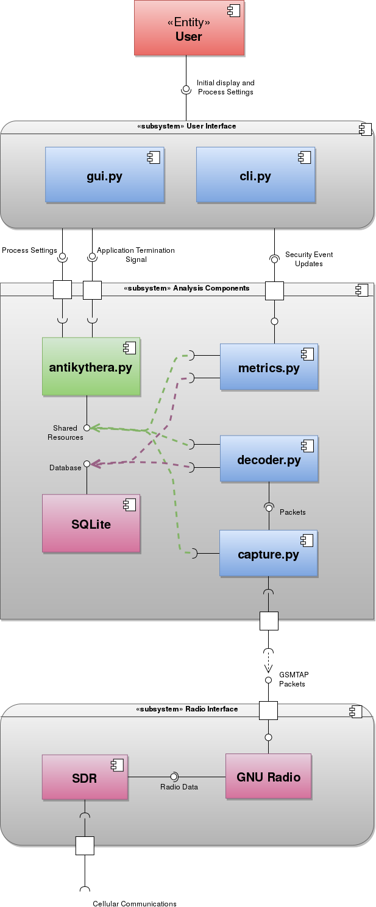
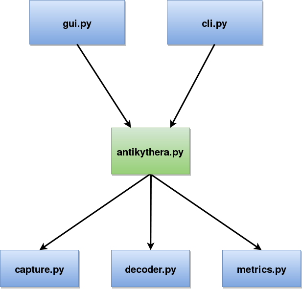

===========
Development
===========

This documentation is meant to be a high level overview of the system. It should quickly familiarize anyone with the codebase enough to get started modifying the codebase.

System Purpose
==============

The antikythera seeks to be able to detect IMSI-Catchers across as many different devices as possible, do so for far under the $40,000 price tag of proprietary products, and have the ability to be a push button solution for cellular security monitoring. The important users are Journalists, Activists, and Organizations. To accommodate the needs of all of the target users the software must be capable of operating both on a small portable device and on a centralized non-mobile device for organizational security audits. 

System Components
=================

The UML component diagram below shows the interfaces between the different components of the system. It is meant to provide a high level overview of the structure of the system. Some conventions that are used are that external system components are colored magenta and all python modules are colored blue except the main module which is colored green.

The **User interface** subsystem provides process settings and application termination signal interfaces which do not connect to ether the ``gui.py`` or ``cli.py`` modules because both modules provide the same interfaces and only one operates at a time. Each is a different entry point to the application and serves the same purpose. It requires an interface to security events and information which it uses to update the display.

The **Radio Interface** subsystem is completely external to the Antikythera application, it is to be installed and configured configured according to the local operating system. The entire Radio Interface may be replaced with any system that provides packet data in the `GSMTAP format <http://osmocom.org/projects/baseband/wiki/GSMTAP>`_.

The **Analysis** subsystem gathers the data about the cellular communications provided by the Radio Interface and process the data to determine if there are any security events. The ``antikythera.py`` module is the main module, and it is subclassed from the ``Multiprocessing Process`` class. The User Interface subsystem creates a new process using the ``Anti`` class which then acts as a process manager for the entire Analysis system completely independent of the entry point ``gui.py`` or ``cli.py``. It creates and distributes all resources needed by the ``metrics.py``, ``decoder.py``, and ``capture.py`` modules.

Each of the three modules ``metrics.py``, ``decoder.py``, and ``capture.py`` are also subclassed from ``Multiprocessing Process``. After creating all of the resources needed for each the ``antikythera.py`` processes creates all three subprocesses and then waits for the application termination signal from the User interface, at which time it propagates the shutdown process to its child processes. The ``capture.py`` component requires GSMTAP packet input which it gathers and puts into a queue and provides, and the ``decoder.py`` component requires that interface. The purpose of separating these two components is to ensure a buffer to handle the varying demand on packet input without data loss. ``decoder.py`` then puts only the needed data into the SQLite database.

By separating the ``metrics.py`` component it is completely independent of the rest of the system besides the database and the need for a shared resource to determine when it is time to terminate. It provides an interface to security events and data which the User Interface subsystem uses to update information displayed to the user.

Multiprocessing
===============

The modules ``gui.py`` and ``cli.py`` are the application entry points, each creates an instance of the ``Anti`` class from the main module ``antikythera.py``. The ``Anti`` class is subclassed from ``Multiprocessing Process`` and it gathers all of the needed resources for the program, starts the subprocesses and acts as a process monitor. This same flow from the User Interface system to the manager process to the workers is followed for process termination. The flow is shown in the diagram below.

